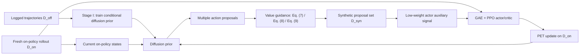

# PPO-DAP

**Diffusion Action Priors for strictly on-policy PPO**

[](https://arxiv.org/abs/2409.01427v6)
[](https://github.com/TianciGao/DiffPPO/releases/tag/v0.1.0)
[](https://www.python.org/)
[](LICENSE)

This repository provides an independent clean-room implementation of **PPO-DAP (PPO with Diffusion Action Prior)** from the paper [*Enhancing Sample Efficiency and Exploration in Reinforcement Learning through the Integration of Diffusion Models and Proximal Policy Optimization*](https://arxiv.org/abs/2409.01427v6).

PPO-DAP keeps the PPO estimator strictly on-policy while using a conditional diffusion action prior to improve exploration around the states visited by the current policy. The prior is pretrained on logged trajectories, adapted online through a small PET/LoRA parameter subset, and used to generate value-guided action proposals. Synthetic proposals influence the actor only through auxiliary regularization; they never enter the PPO/GAE estimator.

> **Repository status.** `v0.1.0` is the released theory-core implementation. The package has been independently validated with `350 passed / 0 failed`. Paper-scale empirical reproduction is **not yet complete**: this repository does not currently claim reproduction of the paper's returns, learning curves, runtime, GPU behavior, or benchmarks.

## Method at a glance



The implementation preserves four central boundaries:

- **On-policy PPO:** PPO/GAE and critic updates use fresh `D_on` only.
- **Separated synthetic data:** `D_syn` affects the actor only through auxiliary terms; it is not treated as an on-policy rollout.
- **Controlled prior adaptation:** the online prior backbone is frozen; PET updates only its designated parameter subset.
- **Read-only monitoring:** diagnostics report training behavior but do not silently change the optimization procedure.

See [Algorithm](docs/ALGORITHM.md) for the full execution flow and [Implementation map](docs/IMPLEMENTATION.md) for the paper-to-code mapping.

## Repository structure

```text
DiffPPO/
├── src/ppo_dap/             # PPO-DAP theory-core implementation
│   ├── actions/             # action types and action-space contracts
│   ├── estimators/          # GAE, PPO and value estimators
│   ├── prior/               # conditional diffusion prior
│   ├── value_guidance/      # value-guided proposal mechanisms
│   ├── objectives/          # actor, critic and PET objectives
│   ├── interfaces/          # composition and ownership boundaries
│   ├── algorithm/           # iteration state and orchestration contracts
│   ├── runtime/             # multi-iteration runtime, RNG and checkpointing
│   └── warm_start/          # controlled initialization support
├── tests/                   # 350-test validation suite
├── docs/                    # algorithm, implementation and conformance docs
├── pyproject.toml
└── uv.lock
```

Some source and test filenames retain internal milestone labels such as `g3`–`g7` and `v1`–`v4`. They are historical implementation boundaries preserved for traceability; they are **not different PPO-DAP algorithm versions**. See [Implementation map](docs/IMPLEMENTATION.md#why-some-files-have-g--and-v--names).

## Installation

The released package targets Python `3.12` and uses `uv 0.12.0` for the locked development environment.

```bash
git clone https://github.com/TianciGao/DiffPPO.git
cd DiffPPO
git checkout v0.1.0
uv sync --frozen --all-groups
```

The stable release is also available as wheel and source distribution from the [v0.1.0 GitHub Release](https://github.com/TianciGao/DiffPPO/releases/tag/v0.1.0).

## Quick verification

```bash
uv run python -c "import ppo_dap; print(ppo_dap.__file__)"
uv run pytest
```

The validated `v0.1.0` release completed the full suite with:

```text
350 passed / 0 failed
```

## Using the library

`v0.1.x` is intentionally a **theory-core library**, not yet a turnkey MuJoCo experiment CLI. The package exposes the implementation components needed to build a paper experiment harness while keeping environment, dataset and runtime integration explicit.

Start with:

- [docs/ALGORITHM.md](docs/ALGORITHM.md) — method and data flow;
- [docs/IMPLEMENTATION.md](docs/IMPLEMENTATION.md) — code map and runtime layers;
- [docs/THEORY_CONFORMANCE.md](docs/THEORY_CONFORMANCE.md) — audited theory boundaries.

## Paper reproduction status

The public theory implementation is complete; **empirical reproduction is tracked separately and is not claimed by `v0.1.0`**. A paper-scale experiment harness must freeze environment versions, logged datasets, seeds, evaluation protocol and runtime adapters before training begins.

This separation is deliberate: experiment code may validate the released algorithm, but it must not redefine it to match a target score.

## Theory conformance

The clean-room implementation was audited against `247/247` paper-derived requirements with `0` conformance blockers. The detailed classification, residual boundaries and validation evidence are in [docs/THEORY_CONFORMANCE.md](docs/THEORY_CONFORMANCE.md).

Machine-readable byte-level release provenance is retained in [docs/PROVENANCE.json](docs/PROVENANCE.json).

## Citation

If you use PPO-DAP or this implementation, please cite the paper:

```bibtex
@article{gao2024ppodap,
  title   = {Enhancing Sample Efficiency and Exploration in Reinforcement Learning through the Integration of Diffusion Models and Proximal Policy Optimization},
  author  = {Gao, Tianci and Neusypin, Konstantin A. and Dmitriev, Dmitry D. and Yang, Bo and Rao, Shengren},
  journal = {arXiv preprint arXiv:2409.01427},
  year    = {2024}
}
```

A machine-readable citation is provided in [`CITATION.cff`](CITATION.cff).

## Releases and legacy history

- Current stable release: [`v0.1.0`](https://github.com/TianciGao/DiffPPO/releases/tag/v0.1.0)
- Release record: [docs/releases/v0.1.0.md](docs/releases/v0.1.0.md)
- The pre-clean-room public implementation remains reachable through the annotated tag `legacy-pre-cleanroom-main` and repository history.

## License

MIT License. See [LICENSE](LICENSE).
